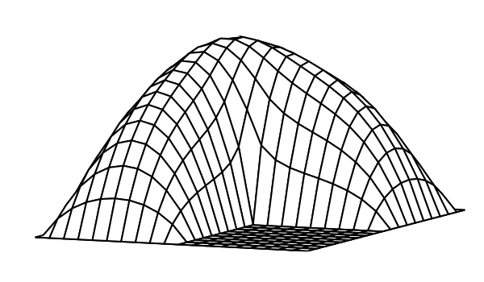
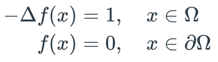
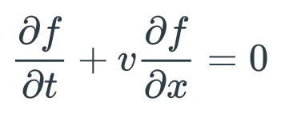
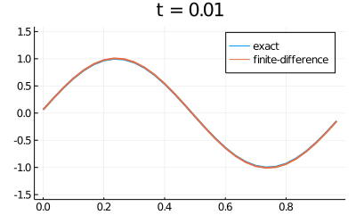
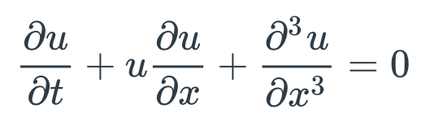
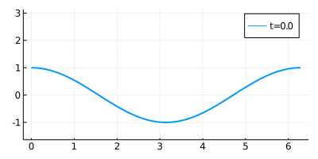
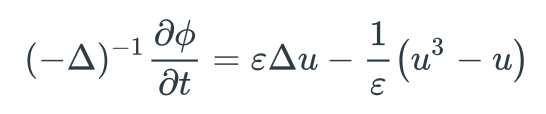

README.md
# MATH 405/607E
# Numerical Methods for Differential Equations

[[Instructor: Christoph Ortner]](http://www.math.ubc.ca/~ortner/)
[[SYLLABUS]](files/syllabus-math405-2022.pdf)
[[PIAZZA]](https://canvas.ubc.ca/courses/103731/external_tools/201?display=borderless)

Questions about the course should normally be posted on [PIAZZA](https://canvas.ubc.ca/courses/103731/external_tools/201?display=borderless) so that the entire group can benefit from the discussion. Please email the instructor only in exceptional circumstances, e.g. when an issue is clearly private. 

[[PIAZZA SIGNUP]](https://piazza.com/ubc.ca/winterterm12022/math4051012022w1)

* Classes are Monday, Wednesday, Friday 1000-1100, West Mall Swing Space  (SWNG) Rm 107  
* Office hours: Monday 1330-1430 and Wed 1100-1200, LSK 303 
* **Midterm: 28/10**

## General Notes 

* You must have access to a [Jupyter](https://jupyter.org) + [Julia](https://julialang.org) environment to complete the assignments. I will provide some instructions on how you can set this up on your private machines, but the recommended and supported way is via a Jupyter Hub server provided by the mathematics department.
* There is a very nice [online textbook written by Toby Driscoll, Fundamentals of Numerical Computation.](https://fncbook.github.io/fnc/frontmatter.html). Although we won't use this book directly the general content and style are similar to MATH 405/607E. Student who would like to get a rough idea what this course will be like can take a look.
* Note there is `dev` branch which we use to test assignments and course notes before releasing them on the `main` branch. You are welcome to look, but DO NOT complete any assignment that hasn't yet been released on the `main` branch!

## Classes

[[Class Notes]](https://notability.com/n/8CcwbmTS3m9B2w6v6dQ~1)

- **Wed 7/9:** intro, admin,  L01, L02
- **Fri 9/9:** more intro, Julia setup, L02, L03 
- **Mon 12/9:** LU factorisation, L04 
- **Wed 14/9:** condition number, eigendecomposition, finish L04
- **Fri 16/9:** floating point arithmetic, L05 
- **Mon 19/9:** no class 
- **Wed 21/9:** Polynomial interpolation, L06 
- **Fri 23/9:** Polynomial interpolation L06, Quadrature L07
- **Mon 26/9:** Finished Quadrature L07
- **Wed 28/9:** Nonlinear equations L08 
- **Fri 30/9:** no class - Truth and reconciliation day
- **Mon 3/10:** Nonlinear systems 

Preview:
- **Wed 5/10:** Initial value problems, Euler method
- **Fri 7/10:** Initial value problems, Euler method
- **Mon 10/10:** no class - Thanksgiving
- **Wed 12/10:** Polynomial regression with Ruo Ning Guo
- **Fri 14/10:** A1, A2 revision class with Ruo Ning Guo

## Tentative Outline 

This is a **tentative** outline of the course material; I will likely shift topics around depending on progress.

* Wk1 (5-9/9) : admin, intro discretisation, Taylor expansion, Julia workshop (5/9 Labour Day)
* Wk2 (12-16/9) : linear systems, review eigenvalue decomposition, floating point arithmetic
* Wk3 (18-23/9) : nonlinear systems and optimisation
* Wk4 (26-30/9) : interpolation and quadrature (30/9 National Day for Truth and Reconciliation)
* Wk5 (3-7/10) : IVPs, Euler method, Runge-Kutta, stability
* Wk6 (10-14/10) : Hamiltonian systems  (10/10 Thanksgiving)
* Wk7 (17-21/10) : 2-point BVPs, review Fourier analysis, PDEs
* Wk8 (24-28/10) : PDEs, **midterm 28/10**
* Wk9 (31/10-4/11) : Complete PDEs, Spectral Methods
* Wk10 (7-11/11) : Spectral Methods (9-11/11 Midterm break)
* Wk11 (14-18/11) : buffer or further topics
* Wk12 (21-25/11) : project presentations
* Wk13 (28/10-2/11) : project presentations
* Wk14 (5-7/12) : revision

## Gallery 

The course "cover image" is the famous Matlab logo. It is the solution of a second-order partial differential boundary value problem on an L-shaped domain.

In the image above we see the numerical solution of an advection equation using an UNSTABLE numerical method. In this course we will learn to recognize and avoid such pitfalls.

We will learn how to construct "spectral methods" to obtain high-accuracy solutions of highly nonlinear PDEs in only a handful of lines of code. Above the Korteveg-deVries equation and below the Cahn-Hilliard equation (modelling phase separation of binary fluids)

<!-- #### Preview 

In our first or second class I will give you a rapid overview to the kind of topics, problems and challenges that we will address in this course (we will of course revisit all of these topic in later classes). Draft notes for the class are here: [[L02-Preview-2ptBVP.ipynb]](notes/L02-Preview-2ptBVP.ipynb). -->

<!-- 
#### Tue 8 Sep 2020

No lecture due to Imagine Day.

#### Thu 10 Sep 2020

- [L01-Introduction.ipynb](notes/L01-Introduction.ipynb) : introduction and motivation for the course
- [L02-Preview-2ptBVP.ipynb](notes/L02-Preview-2ptBVP.ipynb) : finite difference approximation of a 2-point boundary value problem, this provides a rapid overview of several concepts we will study in more detail throughout the course
- Recorded Lecture R01 Error Estimate for the 2-point BVP: [[pdf]](https://www.dropbox.com/s/r3ggku6pei6jyv6/R01-ErrorAnalysis-2ptbvp.pdf?dl=0), [[mov]](https://www.dropbox.com/s/siu1avr9373zkmc/R01-ErrorAnalysis2ptbvp.mov?dl=0), [[m4v]](https://www.dropbox.com/s/wysjmuavxr5tsjx/R01-ErrorAnalysis2ptbvp.m4v?dl=0) -->

<!-- 
#### Tue 15 Sep 2020

 - [L03-LinearSystems.ipynb](notes/L03-LinearSystems.ipynb) : Numerical solution of linear systems, LU factorisation, review of eigendecomposition
 - [WS01-WS01-Installing-Julia.ipynb](notes/WS01-Installing-Julia.ipynb) : setup of the computational infrastructure
 - Recorded lecture R02 on hermitian matrices: [[pdf]](https://www.dropbox.com/s/vw8gl5ylh7cjlji/R02-HermitianMatrices.pdf?dl=0), [[mov]](https://www.dropbox.com/s/ejuw0uteq8g1oik/R02-HermitianMatrices.mov?dl=0), [[m4v]](https://www.dropbox.com/s/fo1tijjubetp8xb/R02-HermitianMatrices.m4v?dl=0)
 - [Live Lecture](https://www.dropbox.com/s/udkht0ad8hpikm3/LL-15Sep.mp4?dl=0)
 - [S01-assignments](https://www.dropbox.com/s/7l0kabfmry4b3m4/S01-assignments.mp4?dl=0) (Additional Recording on How to Complete Assignments)

#### Thu 17 Sep
 - Complete linear systems (eigen decomposition) but you are welcome to read this also on your own; cf. L03
 - The remaining time will be used as an office hour to finalize everybody's setup. If you don't yet have a working setup then please come to this session.
 - [S02-Eigendecomposition](https://www.dropbox.com/s/n2k6vssyn8j0ht2/S02-Eigendecomposition.mp4?dl=0)

#### Tue 22 Sep
 - [L04-Nonlinear-Systems.ipynb](notes/L04-Nonlinear-Systems.ipynb) : Iterative solution of nonlinear equations and systems, Newton, bisection, fixed point iterations.
 - [Live Recording](https://www.dropbox.com/s/qjz0kl3r5pd5v2b/LL-22Sep.mp4?dl=0)
 - Recorded lecture on Newton's method: [[pdf]](https://www.dropbox.com/s/rprve1vekl3jnz0/R03-NewtonMethod.pdf?dl=0), [[mov]](https://www.dropbox.com/s/4ewsg8bemfa2kcp/R03-NewtonMethod.mov?dl=0), [[m4v]](https://www.dropbox.com/s/i8ss4onb06zhbn4/R03-NewtonMethod.m4v?dl=0)
 - The remaining time will be used to discuss miniprojects.

#### Thu 24 Sep
 - Miniproject: C. Ortner - The standard model of Floating Point Arithmetic
 - Miniproject 1 - Group-0 Miniproject - Linear Least Squares and the QR factoriation
 - [Live Recording](https://www.dropbox.com/s/hbcluky2im2np2g/LL-24Sep.mp4?dl=0)

#### Tue 29 Sep
 - [L05-Interpolation-Quadrature.ipynb](notes/L05-Interpolation-Quadrature.ipynb)
 - Recorded Lecture on Weierstrass Approximation Theorem: [[pdf]](https://www.dropbox.com/s/7da4fxrywh2st6r/R04-WeierstrassApxThm.pdf?dl=0), [[mov]](https://www.dropbox.com/s/3q3g1tu6vxgsolu/R04-WeierstrassApxThm.mov?dl=0), [[m4v]](https://www.dropbox.com/s/oq3pohooiz8ko8c/R04-WeierstrassApxThm.m4v?dl=0)
 - [Live Recording](https://www.dropbox.com/s/j3ybkoqb4lx3pvk/LL-29Sep.mp4?dl=0)

#### Thu 1 Oct
 - Miniproject-1 Group-1: Thomas Algorithm
 - Complete [L05-Interpolation-Quadrature.ipynb](notes/L05-Interpolation-Quadrature.ipynb)
 - [Live Recording](https://www.dropbox.com/s/gysgg2gjcokyfbd/LL-01Oct.mp4?dl=0)

### Tue 6 Oct
 - [L06-IVPs.ipynb](notes/L06-IVPs.ipynb) - Numerical solution of ODEs
 - [Live Recording](https://www.dropbox.com/s/l1bls0vf3u2hrxx/LL-06Oct.mp4?dl=0)
 - Recorded lecture R05-GronwallInequalities: [[pdf]](https://www.dropbox.com/s/bz4qria0ip7r4aw/R05-GronwallInequalities.pdf?dl=0), [[mov]](https://www.dropbox.com/s/hneh3ukds4y3sj2/R05-GronwallInequalities.mov?dl=0), [[m4v]](https://www.dropbox.com/s/totdq2rpikhco36/R05-GronwallInequalities.m4v?dl=0)

### Thu 8 Oct
 - Miniproject 1 Group 2 : Steepest descent method
 - Miniproject 1 Group 3 : Nonlinear Least squares
 - [Live Recording](https://www.dropbox.com/s/km2i60203h22su2/LL-08Oct.mp4?dl=0)

### Tue 13 Oct
 - Stability, stiff equations, implicit numerical integrators
 - [L07-L07-IVPs-Stability.ipynb](notes/L07-IVPs-Stability.ipynb)
 - [Live Recording](https://www.dropbox.com/s/dfgll2cwe3878k0/LL-13Oct.mp4?dl=0)

### Thu 15 Oct
 - Miniproject 1 Group 4 : Brent's method
 - Miniproject 1 Group 5 : B-splines
 - [Live Recording](https://www.dropbox.com/s/em09jo0pos7ol9m/LL-15Oct.mp4?dl=0)

### Tue 20 Oct
 - structure preserving numerical integrators: Hamiltonian systems
 - [L08-IVPs-Hamiltonian.ipynb](notes/L08-IVPs-Hamiltonian.ipynb)
 - [Live Recording](https://www.dropbox.com/s/116c6pentcrb486/LL-20Oct.mp4?dl=0)

### Thu 22 Oct
 - [Live Recording](https://www.dropbox.com/s/c3lhppi6f76q4jj/LL-22Oct.mp4?dl=0)
 - Miniproject 1 Group 6 : Compensated summation
 - Miniproject 1 Group 7 : Adaptive Quadrature

### Preparatory reading for PDEs
 - Please Review [L02-Preview-2ptBVP.ipynb](notes/L02-Preview-2ptBVP.ipynb)
 - Recorded lecture R06 on Fourier Analysis: [[pdf]](https://www.dropbox.com/s/im8jqyyyx3lto20/R06-FourierAnalysis.pdf?dl=0) [[mov]](https://www.dropbox.com/s/c5cyj9q7tydfhcv/R06-FourierAnalysis.mov?dl=0) [[m4v]](https://www.dropbox.com/s/t0asyp2jxqgj8ph/R06-FourierAnalysis.m4v?dl=0)
 - If you'd like to dive deeper into this topic I recommend e.g. [Chapter 2](https://people.maths.ox.ac.uk/trefethen/2all.pdf) from Nick Trefethen's lecture notes.

### Tue 27 Oct
 - [L09-PDEs-Diffusion](notes/L09-PDE-Diffusion.ipynb)
 - [Live Recording](https://www.dropbox.com/s/kz6n0g9vl2tj804/LL-27Oct.mp4?dl=0)

### Thu 29 Oct
 - Miniproject 1 Group 8 : Introduction to Multi-step methods
 - Miniproject 1 Group 9 : Adaptive ODE Solvers
 - [Live Recording](https://www.dropbox.com/s/1espj2g2076izez/LL-29Oct.mp4?dl=0)

### Tue 3 Nov
 - [L10-PDEs-Advection](notes/L10-PDE-Advection.ipynb)
 - [Live Recording](https://www.dropbox.com/s/cufecn7fxggo9k2/LL-03Nov.mp4?dl=0)

### Thu 5 Nov 
 - Project 2 - Group 1: QR Algorithm for Eigenvalue Problems
 - [Live Recording](https://www.dropbox.com/s/znrt5eqjt9re8yp/LL-05Nov.mp4?dl=0)

### Tue 10 Nov
 - [L11-SpectralMethods-Approximation](notes/L11-SpectralMethods-Approximation.ipynb)
 - Recorded Lecture on Paley Wiener Theorems: [[pdf]](https://www.dropbox.com/s/yhot3194h9yojd1/R07-PaleyWienerTheorem.pdf?dl=0) [[mov]](https://www.dropbox.com/s/6ecozbehn8300tw/R07-PaleyWienerTheorem.mov?dl=0) [[m4v]](https://www.dropbox.com/s/i2zpre79kgg9jdo/R07-PaleyWienerTheorems.m4v?dl=0)
 - [Live Recording](https://www.dropbox.com/s/p3ihc1vc2qccz7d/LL-10Nov.mp4?dl=0) [[PDF]](https://www.dropbox.com/s/tjvmu8xddnukuv1/LL-10Nov-SpectralMethods-Approx.pdf?dl=0)

### Thu 12 Nov 
  - Miniproject 2 - Group 2 : Symplectic Integrators 
  - Miniproject 2 - Grad-Students : SDEs 
  - [Live Recording](https://www.dropbox.com/s/dxb9yfex24iif7f/LL-12Nov.mp4?dl=0)

### Tue 17 Nov
  - [L12-SpectralMethods-PDE](notes/L12-SpectralMethods-BVPs.ipynb)
  - [Live Recording](https://www.dropbox.com/s/y1sqjjzdtuub7ds/LL-17Nov.mp4?dl=0) [[PDF]](https://www.dropbox.com/s/g3woy9pkqusycpk/LL-17Nov-SpectralMethods-PDEs.pdf?dl=0)

### Thu 19 Nov
  - Project 2 - Lax-Wendroff Scheme
  - [Live Recording](https://www.dropbox.com/s/sjnaci6zuswz7o3/LL-19Nov.mp4?dl=0)

### Preparatory Reading for Fast Solvers / General Interest
 - Implementation of finite-difference laplace operator in 2D, 3D, ...
 - [WS03-FDiff2D](notes/WS03-FDiff2D.ipynb)

### Tue 24 Nov 
  - [L13-LargeLinearSystems](notes/L13-LargeLinearSystems.ipynb)
  - [Live Recording](https://www.dropbox.com/s/sgbiif5d4mdwomn/LL-24Nov.mp4?dl=0)
  - R08-Preconditioning: [[pdf]](https://www.dropbox.com/s/b6rvlaz88fsrjdl/R08-Preconditioning.pdf?dl=0 [[mp4]](https://www.dropbox.com/s/zk6apsj8i9m99ib/R08-Preconditioning.mp4?dl=0)
  - Further reading: Finite Elements and Fast Iterative Solvers, Howard Elman, David Silvester, and Andy Wathen; [[html]](https://global.oup.com/academic/product/finite-elements-and-fast-iterative-solvers-9780199678808?cc=us&lang=en&#)

### Thu 26 Nov
  - Project 2 groups 5 and 6: Nonlinear conservation laws, Fast Fourier Transform

### Tue 1 Dec
  - Guest lecture by Tony Wong on the Closest Point Method 

### Thu 3 Dec 
  - Project 2 groups 7 and 8: tbc -->
